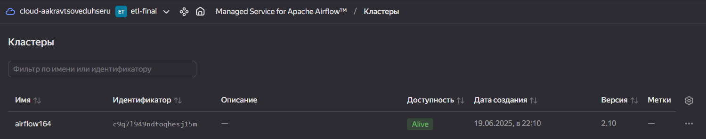
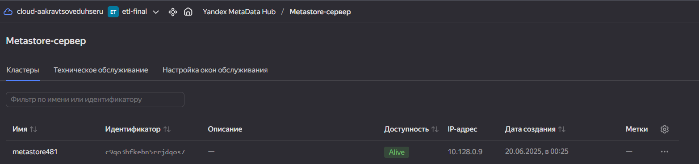
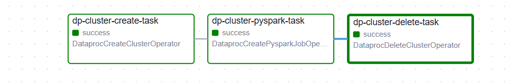
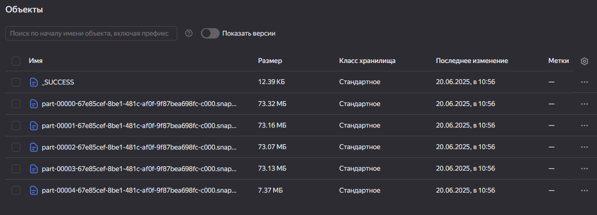

# ETL ДЗ-11


## 1. Был создан кластер Airflow и сервер Metastore



## 2. Подготовлен DAG для автоматизации Dataproc - [тут](data_proc_dag.py)
```python
import uuid
import datetime
from airflow import DAG
from airflow.utils.trigger_rule import TriggerRule
from airflow.providers.yandex.operators.yandexcloud_dataproc import (
    DataprocCreateClusterOperator,
    DataprocCreatePysparkJobOperator,
    DataprocDeleteClusterOperator,
)

# Данные вашей инфраструктуры
YC_DP_AZ = 'ru-central1-a'
YC_DP_SSH_PUBLIC_KEY = 'ssh-ed25519 AAAAC3NzaC1lZDI1NTE5AAAAIExp2ez+oip0e94IwhaPC9dOW9BxxE1frjMzGEkceWdu quandis@ENTERPRISE'
YC_DP_SUBNET_ID = 'e9brnplh0udddoivobeg'
YC_DP_SA_ID = 'ajeun56hkbfrll2qkf0r'
YC_DP_METASTORE_URI = '10.128.0.22'
YC_BUCKET = 'ms-etl-final'

# Настройки DAG
with DAG(
        'DATA_INGEST',
        schedule_interval='@hourly',
        tags=['data-processing-and-airflow'],
        start_date=datetime.datetime.now(),
        max_active_runs=1,
        catchup=False
) as ingest_dag:
    # 1 этап: создание кластера Yandex Data Proc
    create_spark_cluster = DataprocCreateClusterOperator(
        task_id='dp-cluster-create-task',
        cluster_name=f'tmp-dp-{uuid.uuid4()}',
        cluster_description='Временный кластер для выполнения PySpark-задания под оркестрацией Managed Service for Apache Airflow™',
        ssh_public_keys=YC_DP_SSH_PUBLIC_KEY,
        service_account_id=YC_DP_SA_ID,
        subnet_id=YC_DP_SUBNET_ID,
        s3_bucket=YC_BUCKET,
        zone=YC_DP_AZ,
        cluster_image_version='2.1',
        masternode_resource_preset='s2.small',  # минимальный ресурсный пресет
        masternode_disk_type='network-hdd',
        masternode_disk_size=32,  # уменьшенный размер диска
        computenode_resource_preset='s2.small',  # уменьшенный ресурсный пресет
        computenode_disk_type='network-hdd',
        computenode_disk_size=32,  # уменьшенный размер диска
        computenode_count=1,  # уменьшенное количество узлов
        computenode_max_hosts_count=3,  # уменьшенное максимальное масштабирование
        services=['YARN', 'SPARK'],
        datanode_count=0,
        properties={
            'spark:spark.hive.metastore.uris': f'thrift://{YC_DP_METASTORE_URI}:9083',
        },
    )

# 2 этап: запуск задания PySpark
poke_spark_processing = DataprocCreatePysparkJobOperator(
    task_id='dp-cluster-pyspark-task',
    main_python_file_uri=f's3a://{YC_BUCKET}/scripts/process_data.py',
)

# 3 этап: удаление кластера Yandex Data Processing
delete_spark_cluster = DataprocDeleteClusterOperator(
    task_id='dp-cluster-delete-task',
    trigger_rule=TriggerRule.ALL_DONE,
)

# Формирование DAG из указанных выше этапов
create_spark_cluster >> poke_spark_processing >> delete_spark_cluster
```

## 3. Подготовлен скрипт для процессинга данных - [тут](process_data.py)
```python
from pyspark.sql import SparkSession
from pyspark.sql.functions import col, when
from pyspark.sql.types import IntegerType, DoubleType, StringType, ByteType
from pyspark.sql.utils import AnalysisException

spark = SparkSession.builder.appName("Transactions_v2 ETL with Logging to S3").getOrCreate()

source_path = "s3a://ms-etl-final/raw-data/transactions_v2.csv"
target_path = "s3a://ms-etl-final/processed-data/transactions_v2-processed.parquet"

try:
    print(f"Чтение данных из: {source_path}")
    df = spark.read.option("header", "true").csv(source_path)

    print("Схема исходных данных:")
    df.printSchema()

    # Приведение типов согласно структуре таблицы
    df = df.withColumn("id", col("id").cast(IntegerType())) \
           .withColumn("step", col("step").cast(IntegerType())) \
           .withColumn("type", col("type").cast(StringType())) \
           .withColumn("amount", col("amount").cast(DoubleType())) \
           .withColumn("nameOrig", col("nameOrig").cast(StringType())) \
           .withColumn("oldbalanceOrig", col("oldbalanceOrig").cast(DoubleType())) \
           .withColumn("newbalanceOrig", col("newbalanceOrig").cast(DoubleType())) \
           .withColumn("isFraud", col("isFraud").cast(ByteType())) \
           .withColumn("isFlaggedFraud", col("isFlaggedFraud").cast(ByteType()))

    print("Схема после приведения типов:")
    df.printSchema()

    # удаляем строки с пропущенными обязательными полями
    df = df.na.drop(subset=["id", "step", "type", "amount", "nameOrig", "oldbalanceOrig", "newbalanceOrig", "isFraud", "isFlaggedFraud"])

    # если oldbalanceOrig < 0, считаем это ошибкой и ставим null
    df = df.withColumn("oldbalanceOrig", when(col("oldbalanceOrig") < 0, None).otherwise(col("oldbalanceOrig")))

    print("Пример данных после обработки:")
    df.show(5, truncate=False)

    print(f"Запись в Parquet: {target_path}")
    df.write.mode("overwrite").parquet(target_path)

    print("Данные сохранены в Parquet.")

except Exception as e:
    print("Ошибка:", e)

spark.stop()

```

## 4. DAG запущен и успешно выполнен.



## 5. Полученные результаты сохранены в Object Storage в формате parquet:

