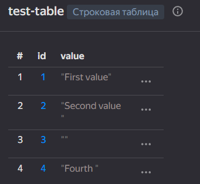

# ETL ДЗ-12

## 1. Создана YDB с тестовой таблицей




## 2. Создание облачной функции на Python

Код функции:
```python
import os
import ydb
import ydb.iam

# Create driver in global space.
driver = ydb.Driver(
  endpoint=os.getenv('YDB_ENDPOINT'),
  database=os.getenv('YDB_DATABASE'),
  credentials=ydb.iam.MetadataUrlCredentials(),
)

# Wait for the driver to become active for requests.

driver.wait(fail_fast=True, timeout=5)

# Create the session pool instance to manage YDB sessions.
pool = ydb.SessionPool(driver)

def execute_query(session):
  # Create the transaction and execute query.
  return session.transaction().execute(
    'select count(*) as cnt from test_table;',
    commit_tx=True,
    settings=ydb.BaseRequestSettings().with_timeout(3).with_operation_timeout(2)
  )

def handler(event, context):
  # Execute query with the retry_operation helper.
  result = pool.retry_operation_sync(execute_query)
  return {
    'statusCode': 200,
    'body': str(result[0].rows[0].cnt),
  }

```


Далее функция была протестирована:

