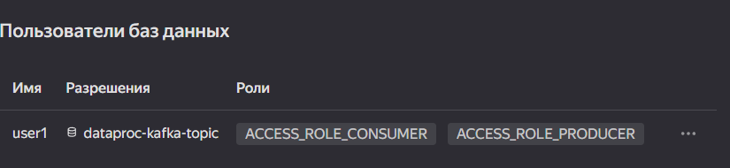
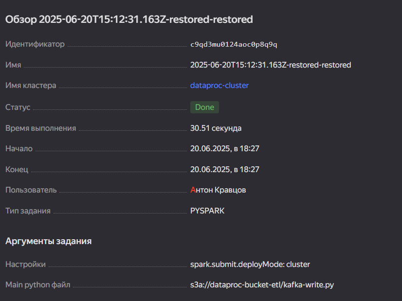

# ETL ДЗ-13

# 1. Созданы кластеры Data Proc и Kafka


# 2. Создан топик и юзер для Kafka




# 3. Создано задание для PySpark

Скрипт `kafka-write.py`:
```python
#!/usr/bin/env python3

from pyspark.sql import SparkSession, Row
from pyspark.sql.functions import to_json, col, struct

def main():
   spark = SparkSession.builder.appName("dataproc-kafka-write-app").getOrCreate()

   df = spark.createDataFrame([
      Row(msg="Test message #1 from dataproc-cluster"),
      Row(msg="Test message #2 from dataproc-cluster")
   ])
   df = df.select(to_json(struct([col(c).alias(c) for c in df.columns])).alias('value'))
   df.write.format("kafka") \
      .option("kafka.bootstrap.servers", "rc1a-e532km5oqh7l4uti.mdb.yandexcloud.net:9091") \
      .option("topic", "dataproc-kafka-topic") \
      .option("kafka.security.protocol", "SASL_SSL") \
      .option("kafka.sasl.mechanism", "SCRAM-SHA-512") \
      .option("kafka.sasl.jaas.config",
              "org.apache.kafka.common.security.scram.ScramLoginModule required "
              "username=user1 "
              "password=password1 "
              ";") \
      .save()

if __name__ == "__main__":
   main()

```

Скрипт `kafka-read-stream.py`:
```python
#!/usr/bin/env python3

from pyspark.sql import SparkSession, Row
from pyspark.sql.functions import to_json, col, struct

def main():
   spark = SparkSession.builder.appName("dataproc-kafka-read-stream-app").getOrCreate()

   query = spark.readStream.format("kafka")\
      .option("kafka.bootstrap.servers", "rc1a-e532km5oqh7l4uti.mdb.yandexcloud.net:9091") \
      .option("subscribe", "dataproc-kafka-topic") \
      .option("kafka.security.protocol", "SASL_SSL") \
      .option("kafka.sasl.mechanism", "SCRAM-SHA-512") \
      .option("kafka.sasl.jaas.config",
              "org.apache.kafka.common.security.scram.ScramLoginModule required "
              "username=user1 "
              "password=password1 "
              ";") \
      .option("startingOffsets", "earliest")\
      .load()\
      .selectExpr("CAST(value AS STRING)")\
      .where(col("value").isNotNull())\
      .writeStream\
      .trigger(once=True)\
      .queryName("received_messages")\
      .format("memory")\
      .start()

   query.awaitTermination()

   df = spark.sql("select value from received_messages")

   df.write.format("text").save("s3a://dataproc-bucket/kafka-read-stream-output")

if __name__ == "__main__":
   main()

```

Задание на запись успешно выполнено:



Задание на чтение успешно выполнено:


Выходные данные:

